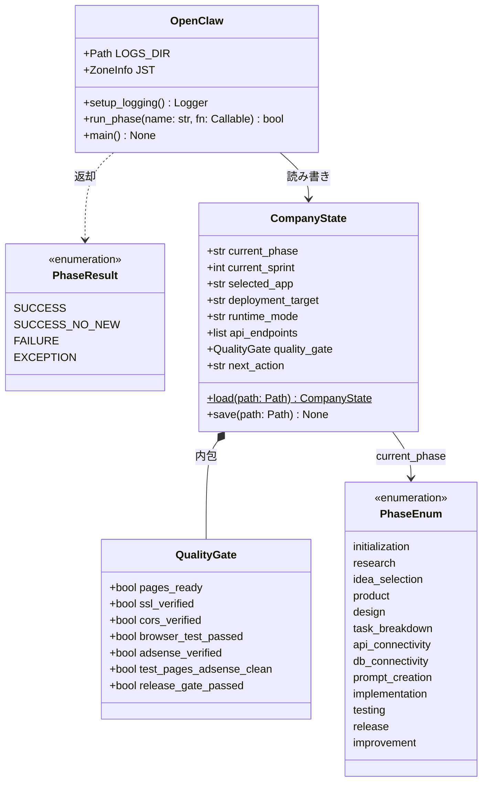
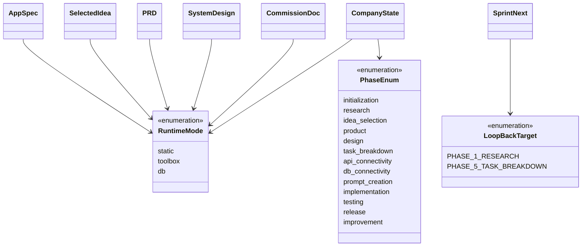
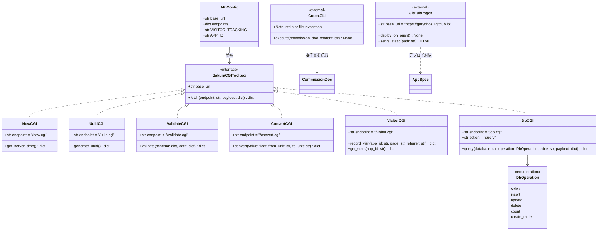
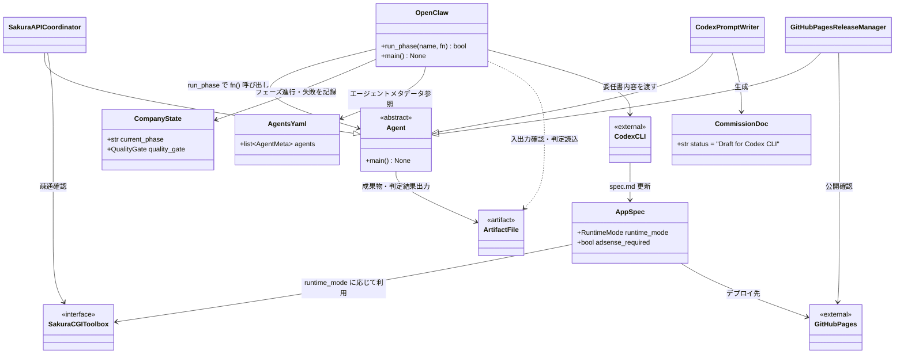

# CLASS.md — OpenClaw App Company クラス図

- 対象: SPEC.md v0.9 / SEQUENCE.md
- 作成日: 2026-03-23

---

## 1. オーケストレータとフェーズ管理

`scripts/main.py` を中心とした実行制御層のクラス構造。

---

## 2. エージェント基底クラスと組織

すべてのエージェントが継承する基底クラスと、30体の配置。

```mermaid
classDiagram
    class Agent {
        <<abstract>>
        +str id
        +str name
        +str role
        +list responsibilities
        +list inputs
        +list outputs
        +list can_run
        +bool human_approval_required
        +setup_logging() Logger
        +main() None
    }

    class AgentsYaml {
        +list~AgentMeta~ agents
        +load(path: Path) AgentsYaml$
        +find(id: str) AgentMeta
    }

    class AgentMeta {
        +str id
        +str name
        +str role
        +list responsibilities
        +list inputs
        +list outputs
        +list can_run
        +bool human_approval_required
    }

    Agent <|-- CEOAgent
    Agent <|-- COOAgent
    Agent <|-- ROIAgent
    Agent <|-- MarketResearcher
    Agent <|-- TrendAnalyst
    Agent <|-- PainFinder
    Agent <|-- CompetitorAnalyst
    Agent <|-- IdeaScorer
    Agent <|-- ProductPlanner
    Agent <|-- UXScenarioWriter
    Agent <|-- ValuePropositionAgent
    Agent <|-- PRDWriter
    Agent <|-- SolutionArchitect
    Agent <|-- FrontendArchitect
    Agent <|-- APIIntegrationArchitect
    Agent <|-- ADRWriter
    Agent <|-- TechLeadAgent
    Agent <|-- TaskBreakdownAgent
    Agent <|-- CodexPromptWriter
    Agent <|-- RefactorDirector
    Agent <|-- TestDesigner
    Agent <|-- TDDEnforcer
    Agent <|-- BugTriageAgent
    Agent <|-- BrowserTestOperator
    Agent <|-- DesignCritic
    Agent <|-- CopyCritic
    Agent <|-- AccessibilityReviewer
    Agent <|-- GitHubPagesReleaseManager
    Agent <|-- SakuraAPICoordinator
    Agent <|-- ImprovementStrategist

    AgentsYaml *-- AgentMeta : 1..*
    OpenClaw --> AgentsYaml : 参照（メタデータ台帳）
```

---

## 3. エージェント部門と担当フェーズ

30体を部門でグループ化し、担当フェーズとの対応を示す。

```mermaid
classDiagram
    namespace Executive {
        class CEOAgent {
            +approve_product_direction()
            +approve_release()
            +judge_sprint_continuation()
        }
        class COOAgent {
            +advance_phase()
            +relay_department_requests()
            +visualize_blockers()
        }
        class ROIAgent {
            +evaluate_roi_lightweight() Note
            +evaluate_roi_detail() Note
        }
    }

    namespace ResearchDept {
        class MarketResearcher {
            +inputs: roadmap_md, sprints, web
            +outputs: research_report_md, source_notes_md
            +research() None
        }
        class TrendAnalyst {
            +outputs: idea_pool_md
            +analyze_trends() None
        }
        class PainFinder {
            +outputs: idea_pool_md
            +find_pains() None
        }
        class CompetitorAnalyst {
            +outputs: idea_pool_md
            +analyze_competitors() None
        }
        class IdeaScorer {
            +outputs: scored_ideas_md
            +score_ideas() None
        }
    }

    namespace PlanningDept {
        class ProductPlanner {
            +outputs: prd_md
            +plan_product() None
        }
        class UXScenarioWriter {
            +outputs: prd_md
            +write_scenarios() None
        }
        class ValuePropositionAgent {
            +outputs: prd_md
            +define_value_prop() None
        }
        class PRDWriter {
            +outputs: prd_md
            +write_prd() None
        }
    }

    namespace DesignDept {
        class SolutionArchitect {
            +outputs: system_design_md
            +design_system() None
        }
        class FrontendArchitect {
            +outputs: system_design_md
            +design_frontend() None
        }
        class APIIntegrationArchitect {
            +decide_runtime_mode() RuntimeMode
            +select_cgi() None
        }
        class ADRWriter {
            +outputs: adr_md
            +write_adr() None
        }
    }

    namespace ImplDept {
        class TechLeadAgent {
            +design_impl_order() None
            +decide_delegation_unit() None
            +review_commission_doc() None
        }
        class TaskBreakdownAgent {
            +outputs: tasks_md
            +breakdown_tasks() None
        }
        class CodexPromptWriter {
            +outputs: task_xxx_md
            +write_commission_doc() None
        }
        class RefactorDirector {
            +direct_refactoring() None
        }
    }

    namespace QADept {
        class TestDesigner {
            +outputs: qa_report_md
            +define_test_cases() None
        }
        class TDDEnforcer {
            +check_acceptance_conditions() None
            +reject_if_no_test() None
        }
        class BugTriageAgent {
            +outputs: qa_report_md
            +triage_bugs() None
        }
        class BrowserTestOperator {
            +check_published_pages() None
            +check_local_db_pages() None
            +outputs: browser_test_report_md
        }
    }

    namespace DesignReviewDept {
        class DesignCritic {
            +review_layout() None
            +outputs: design_review_md
        }
        class CopyCritic {
            +review_copy() None
        }
        class AccessibilityReviewer {
            +review_accessibility() None
        }
    }

    namespace ReleaseDept {
        class GitHubPagesReleaseManager {
            +check_adsense_gate() bool
            +check_public_url() None
            +outputs: deploy_report_md
        }
        class SakuraAPICoordinator {
            +check_connectivity() None
            +select_cgi_endpoints() None
        }
        class ImprovementStrategist {
            +collect_feedback() None
            +propose_loop_back() LoopBackTarget
            +outputs: user_feedback_md, usage_insights_md
        }
    }

    ROIAgent ..> IdeaScorer : 足切り依頼（Phase 2）
    ROIAgent ..> PRDWriter : PRD詳細評価（Phase 3）
    ImprovementStrategist ..> COOAgent : ループバック一次提案
    COOAgent ..> CEOAgent : 最終承認依頼
    TechLeadAgent ..> CodexPromptWriter : レビュー
```

---

## 4. 成果物ファイルクラス

`artifacts/` `state/` `apps/` 配下の主要ファイルをクラスとして表現。

```mermaid
classDiagram
    class ResearchReport {
        +str path = "artifacts/research/research_report.md"
        +str content
    }
    class SourceNotes {
        +str path = "artifacts/research/source_notes.md"
        +list~str~ source_urls
    }
    class IdeaPool {
        +str path = "artifacts/research/idea_pool.md"
        +list~IdeaEntry~ ideas
    }
    class IdeaEntry {
        +str title
        +str pain_point
        +str trend_note
        +str competitor_note
    }
    class ScoredIdeas {
        +str path = "artifacts/research/scored_ideas.md"
        +list~ScoredIdea~ ideas
    }
    class ScoredIdea {
        +str title
        +int difficulty_score
        +int value_score
        +int trend_score
        +int pages_fit_score
        +float roi_score
    }
    class SelectedIdea {
        +str path = "artifacts/research/selected_idea.md"
        +str title
        +str summary
        +RuntimeMode runtime_mode
    }
    class PRD {
        +str path = "artifacts/product/prd.md"
        +str background
        +str problem
        +str target_user
        +list~str~ use_cases
        +str mvp_scope
        +str non_functional
        +str success_metrics
        +str out_of_scope
        +RuntimeMode runtime_mode
    }
    class SystemDesign {
        +str path = "artifacts/design/system_design.md"
        +str folder_name
        +str url_path
        +list~str~ screens
        +RuntimeMode runtime_mode
        +list~str~ api_endpoints
    }
    class TasksDoc {
        +str path = "artifacts/design/tasks.md"
        +list~Task~ tasks
    }
    class Task {
        +str task_id
        +str purpose
        +str target_file
        +str input_file
        +str output_file
        +list~str~ completion_criteria
    }
    class CommissionDoc {
        +str path = "artifacts/prompts/task-xxx.md"
        +str task_id
        +str project
        +str phase
        +str status = "Draft for Codex CLI"
        +str purpose
        +list~str~ scope_in
        +list~str~ scope_out
        +RuntimeMode runtime_mode
        +list~str~ completion_criteria
        +list~str~ test_points
        +list~str~ prohibitions
    }
    class AppSpec {
        +str path = "apps/app-xxx-name/spec.md"
        +str app_id
        +str app_name
        +str summary
        +str target_user
        +list~str~ main_use_cases
        +RuntimeMode runtime_mode
        +list~str~ api_endpoints
        +str storage_strategy
        +bool visitor_tracking
        +str visitor_tracking_reason
        +list~str~ cors_origins
        +bool ssl_checked
        +str pages_path
        +list~str~ known_constraints
        +list~str~ acceptance_criteria
        +bool adsense_required
        +bool adsense_applied
        +bool adsense_checked_at_release
        +str adsense_exception_reason
    }
    class DeployReport {
        +str path = "artifacts/sprints/deploy_report.md"
        +str public_url
        +str build_status
        +str adsense_check_result
        +bool test_pages_adsense_clean
        +bool index_updated
        +list~str~ known_issues
        +bool release_gate_passed
    }
    class SprintNext {
        +str path = "artifacts/sprints/sprint_next.md"
        +list~str~ improvement_items
        +LoopBackTarget loop_back_target
    }
    class UserFeedback {
        +str path = "artifacts/sprints/user_feedback.md"
        +list~str~ qualitative_notes
    }
    class UsageInsights {
        +str path = "artifacts/sprints/usage_insights.md"
        +int total_visits
        +list~str~ top_pages
        +list~str~ peak_hours
    }
    class AppInventory {
        +str path = "artifacts/research/app_inventory.md"
        +list~AppSummary~ apps
    }
    class AppSummary {
        +str app_id
        +str app_name
        +str status
        +RuntimeMode runtime_mode
        +str pages_url
    }

    IdeaPool *-- IdeaEntry
    ScoredIdeas *-- ScoredIdea
    TasksDoc *-- Task
    AppInventory *-- AppSummary
    SprintNext --> LoopBackTarget
```

---

## 5. 列挙型・バリュータイプ

---

## 6. 外部システムインターフェース

Sakura CGI Toolbox・Codex CLI・GitHub Pages の境界クラス。

---

## 7. システム全体の依存関係

主要クラス間の依存・関連を俯瞰する。

---

_以上。不明点は QandA.md に追記。_
