# SEQUENCE.md — OpenClaw App Company シーケンス図

- 対象: SPEC.md v0.7
- 作成日: 2026-03-23

---

## 1. メインオーケストレーション（フェーズ起動・進行フロー）

運営者が `scripts/main.py` を起動し、各フェーズを順に進める全体フロー。

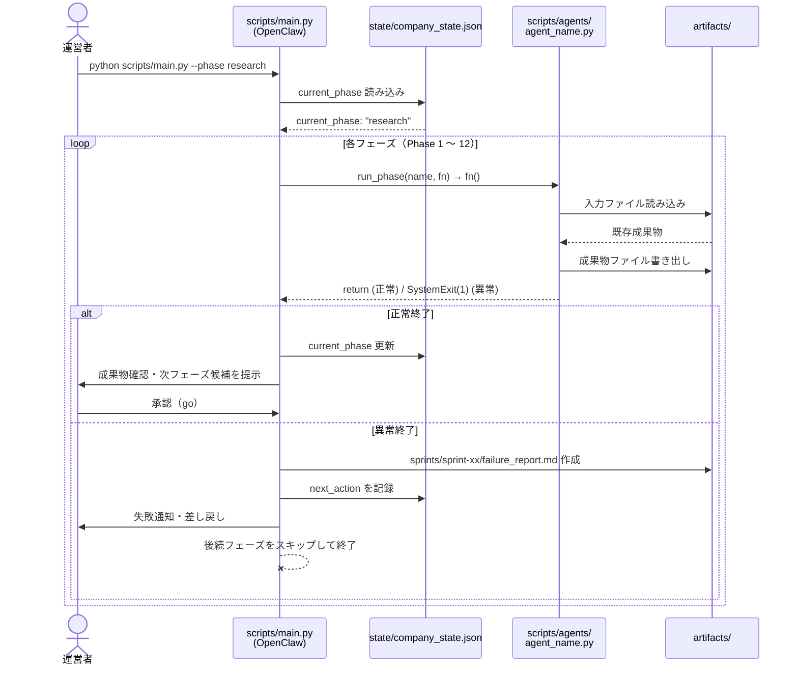

---

## 2. run_phase ヘルパーの詳細フロー

`run_phase()` が各エージェントの `main()` を呼び出し、終了コードを判定する。

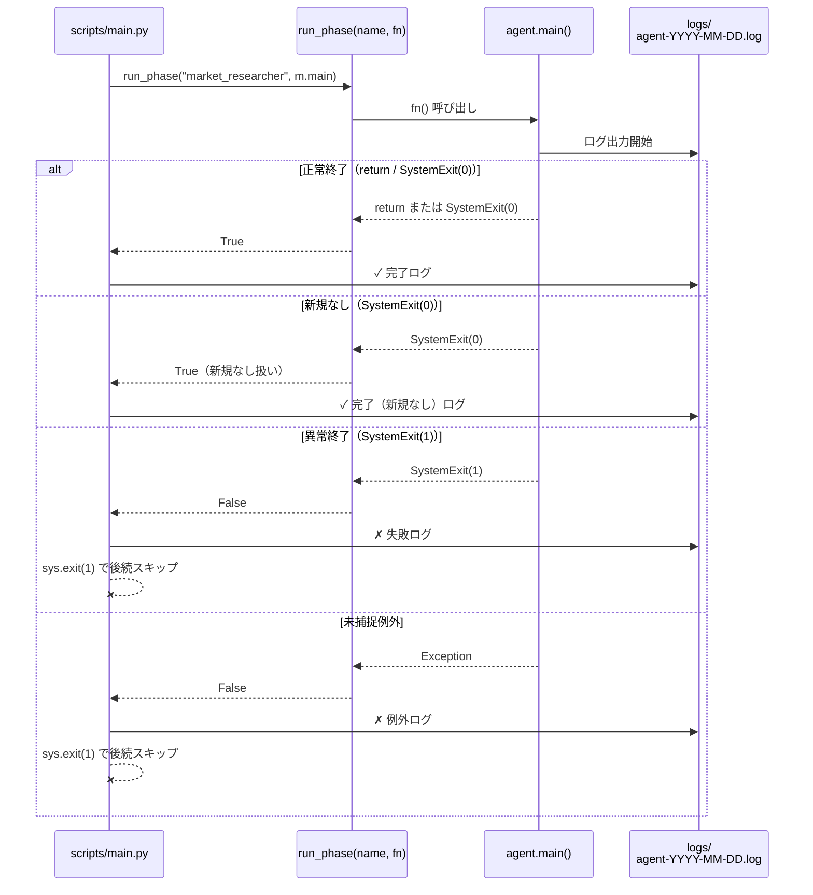

---

## 3. 市場調査〜アイデア選定フロー（Phase 1〜2）

Market Researcher が3系統の入力から調査し、ROI Agent が二段階で評価する。

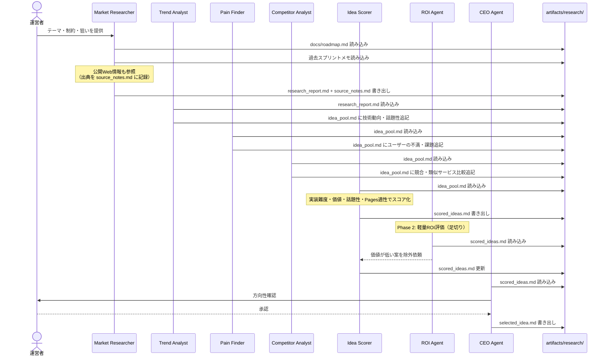

---

## 4. PRD 作成フロー（Phase 3）

企画部が PRD を作成し、ROI Agent が詳細評価する。

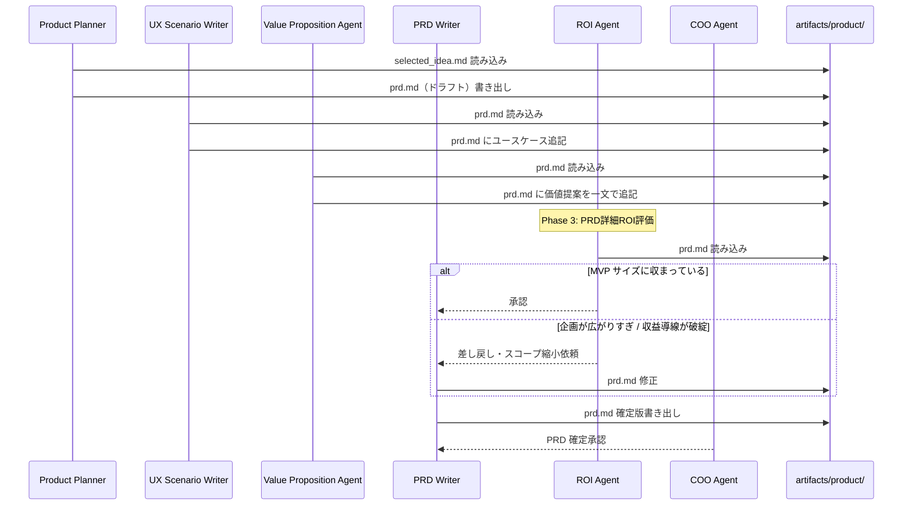

---

## 5. 設計〜タスク分解フロー（Phase 4〜5）

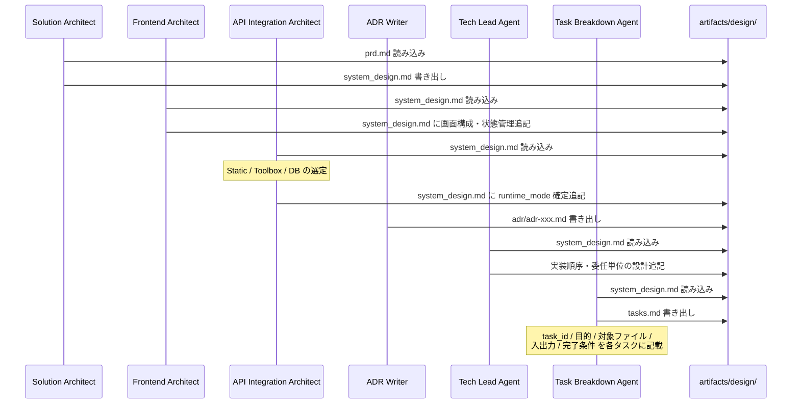

---

## 6. API 疎通確認フロー（Phase 6）

必要時のみ実施。Sakura API Coordinator が主担当。

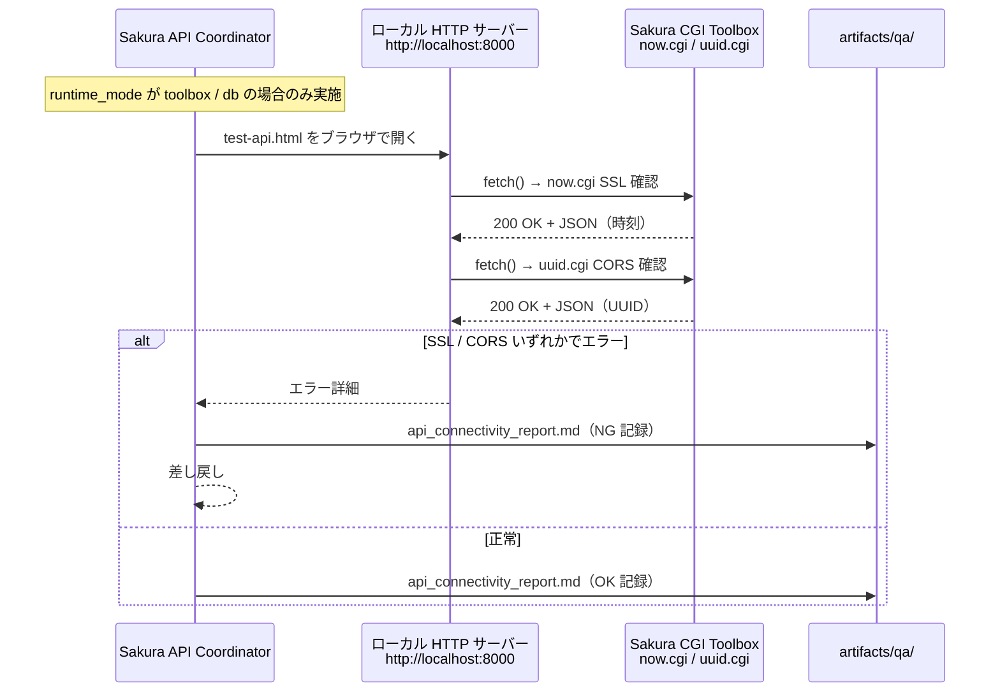

---

## 7. DB 接続確認フロー（Phase 7）

DB 利用時のみ実施。

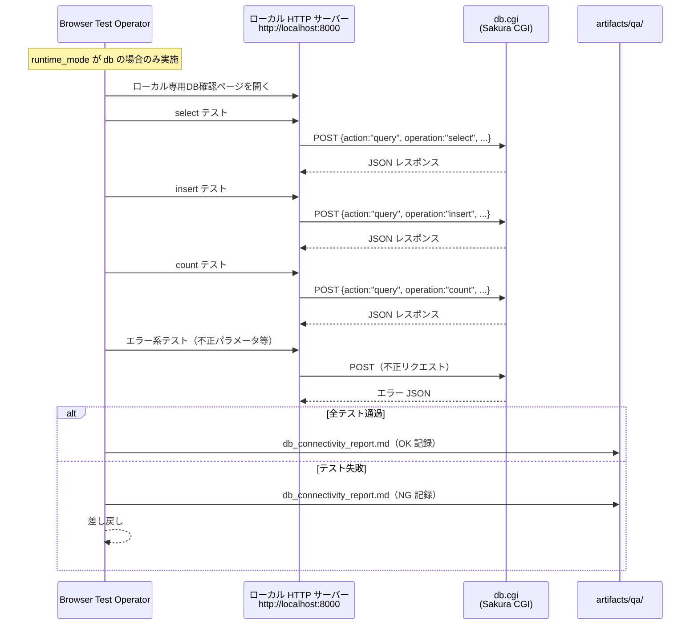

---

## 8. Codex CLI 委任フロー（Phase 8〜9）

疎通確認後に委任書を確定し、Codex CLI にコード生成を委任する。

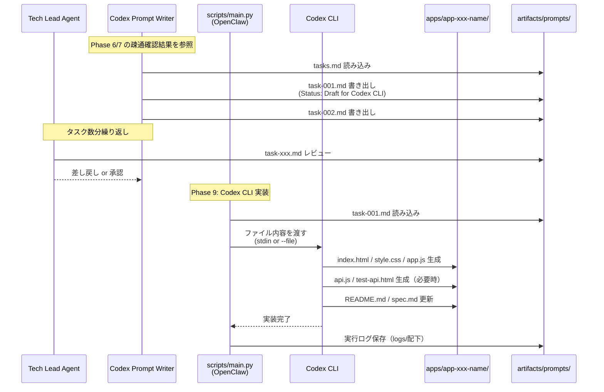

---

## 9. テスト・品質審査フロー（Phase 10）

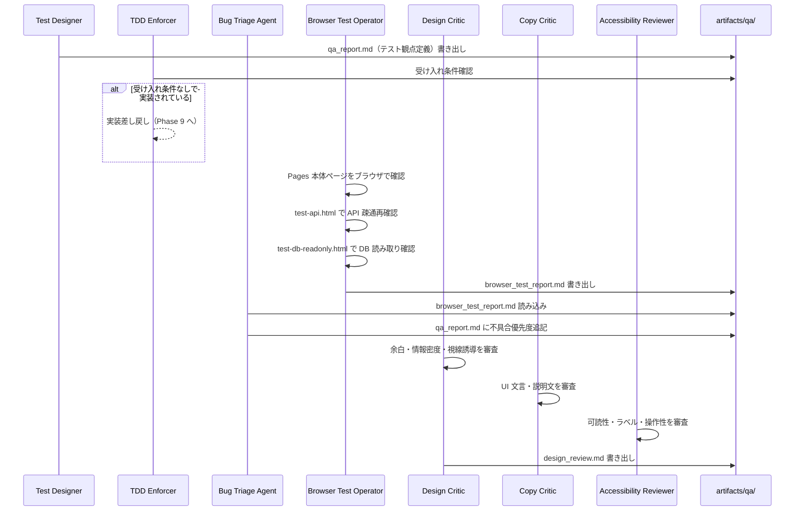

---

## 10. GitHub Pages 公開フロー（Phase 11）

AdSense 確認を含むリリースゲートを通過した後、人間承認で push する。

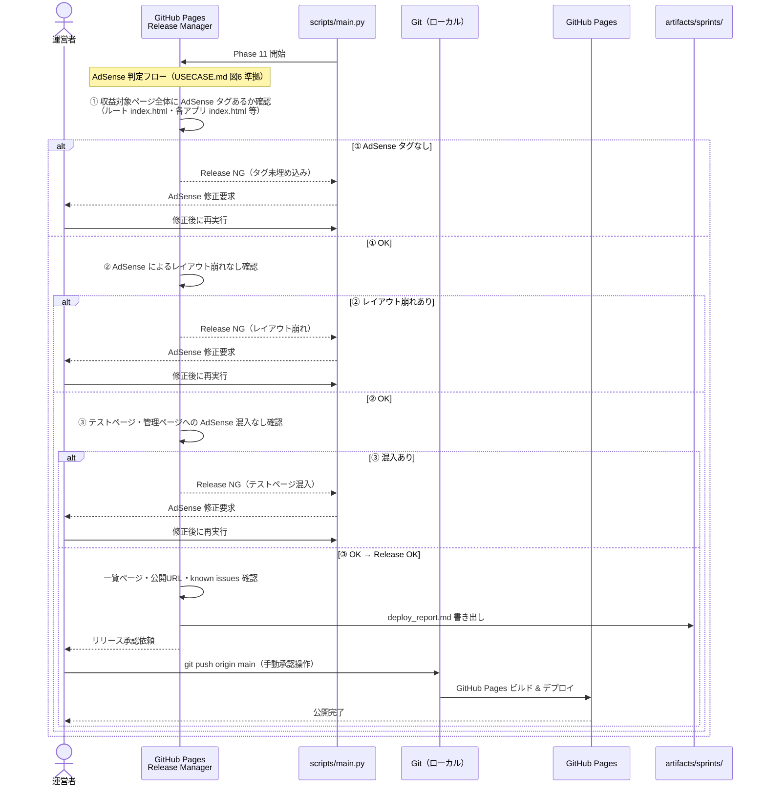

---

## 11. エンドユーザーのアプリ利用フロー

公開後のアプリをエンドユーザーが利用し、visitor.cgi に自動記録される。

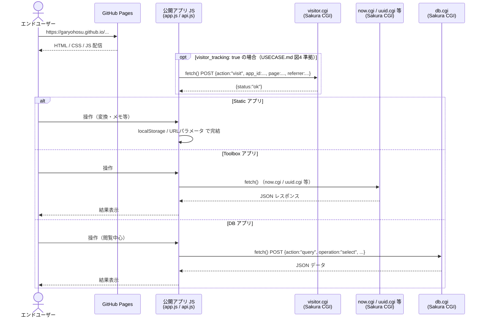

---

## 12. 改善スプリントのループ判断フロー（Phase 12）

フィードバックを収集し、次の行き先（Phase 1 か Phase 5 か）を判断する。

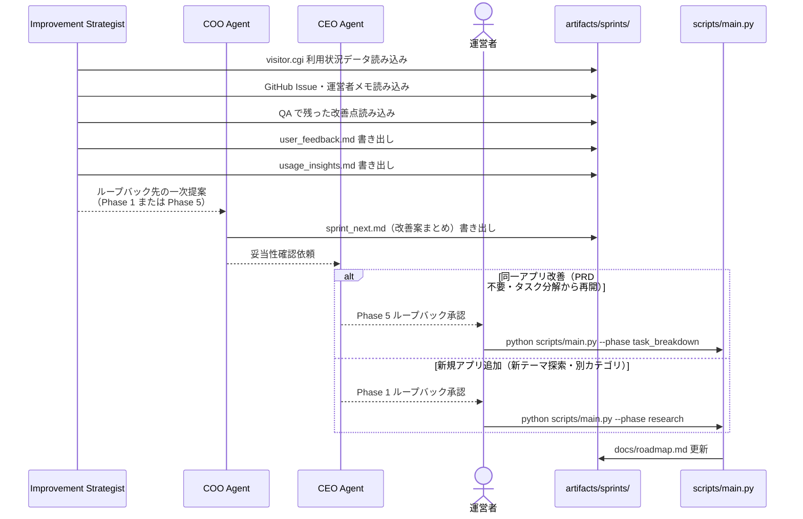

---

_以上。不明点は QandA.md に追記。_
