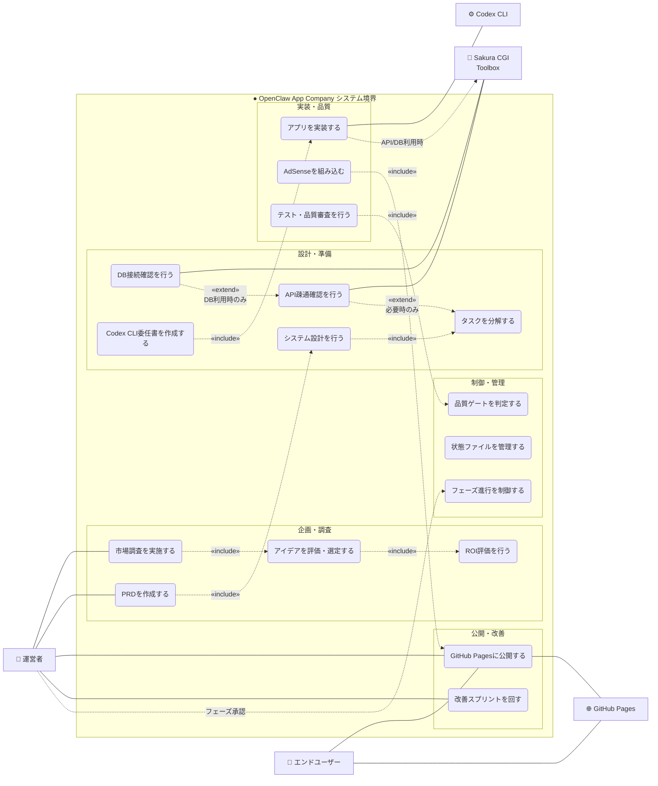
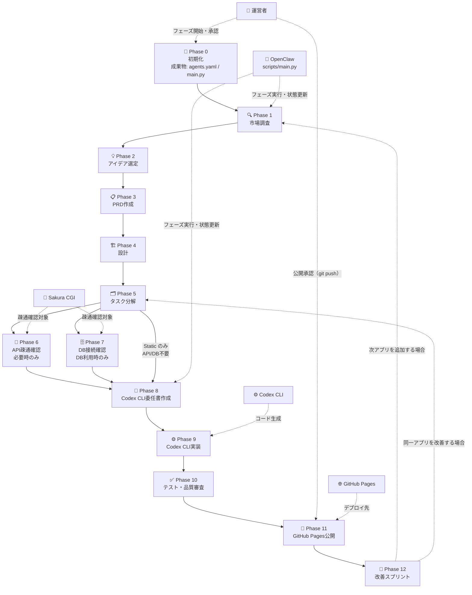
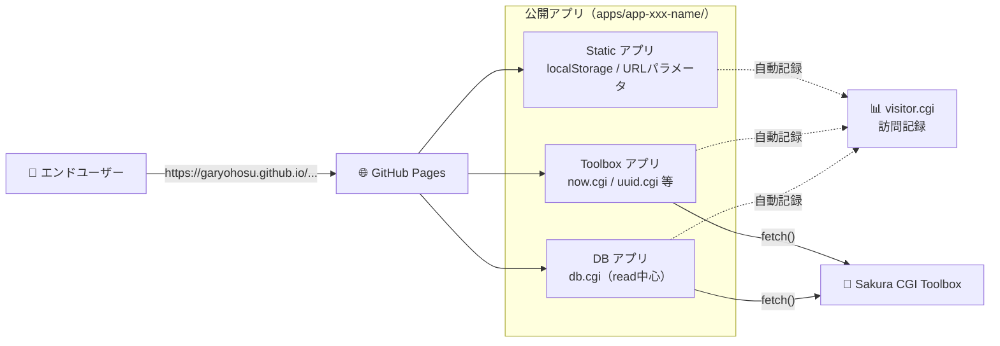
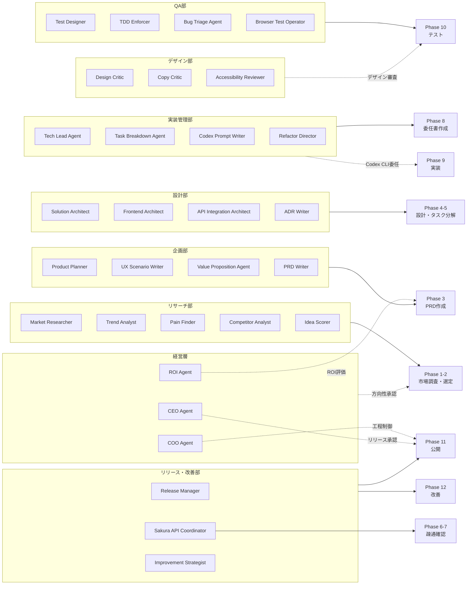
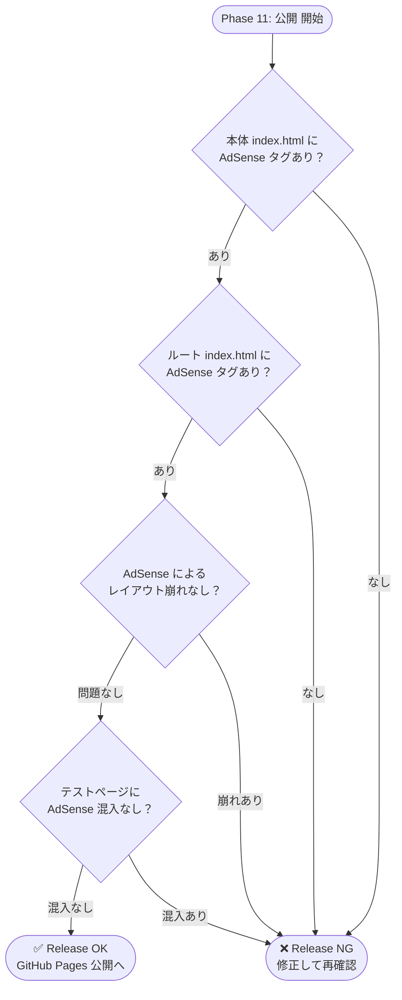

# USECASE.md — OpenClaw App Company ユースケース図

- 対象: SPEC.md v0.5
- 作成日: 2026-03-23

---

## 1. アクター一覧

| アクター | 種別 | 説明 |
|---------|-----|------|
| 運営者 | 主アクター | フェーズ開始・承認・公開判断を行う人間 |
| エンドユーザー | 主アクター | 公開されたアプリを利用する利用者 |
| Codex CLI | 外部システム | アプリコードを生成する実装エンジン |
| GitHub Pages | 外部システム | 静的アプリを配信するホスティング基盤 |
| Sakura CGI Toolbox | 外部システム | 時刻・UUID・DB等の軽量バックエンド |

---

## 2. 全体ユースケース図

---

## 3. フェーズワークフロー図

Phase 0〜12 の実行順序と、各フェーズに関与するアクターを示す。

---

## 4. アプリ利用フロー（エンドユーザー視点）

公開後のアプリをエンドユーザーがどう利用するかを示す。

---

## 5. エージェント組織と担当フェーズの対応

30体のエージェントがどのフェーズで主に動くかを示す。

---

## 6. AdSense 組み込み判定フロー

---

_以上。不明点は QandA.md に追記。_
